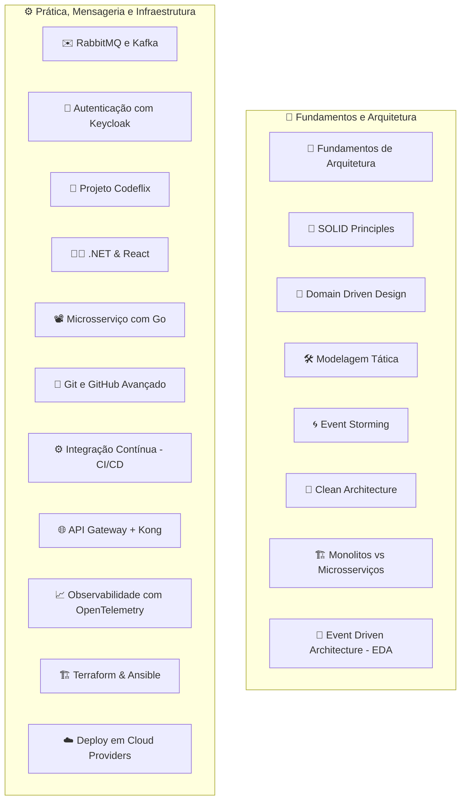

# 🧠 Fluxo de Estudo do Full Cycle para Arquiteto de Software

> Um guia estruturado para desenvolvedores que desejam se tornar arquitetos de software modernos e prontos para ambientes corporativos de alta complexidade.

---

## 🔄 Visão Geral do Fluxo

---

## 🧱 Etapas e Conteúdos

### 1. 📐 [Fundamentos da Arquitetura de Software](https://github.com/daniloopinheiro/fullcycle-arquiteto-software/blob/main/FundamentosArquiteturaSoftware.md)

* Conceitos básicos, estilos arquiteturais e papel do arquiteto.

### 2. 🧩 [SOLID Principles](https://github.com/daniloopinheiro/fullcycle-arquiteto-software/blob/main/SOLIDPrinciples.md)

* Princípios de design para sistemas sustentáveis.

### 3. 📘 Domain Driven Design (DDD)

* Entidades, Agregados, Repositórios e Contexto Delimitado.

### 4. 🛠️ Modelagem Tática em DDD

* Value Objects, Factories, Services, Specifications.

### 5. 🌀 Event Storming na Prática

* Descoberta colaborativa de eventos e fluxo de negócio.

### 6. 🧼 Arquitetura Hexagonal e Clean Architecture

* Separação de preocupações, Ports & Adapters, Onion Architecture.

### 7. 🏗️ Sistemas Monolíticos vs. Microsserviços

* Estratégias, trade-offs e aplicação prática.

### 8. 📡 Event Driven Architecture (EDA)

* Event Sourcing, CQRS, mensageria assíncrona.

### 9. ✉️ RabbitMQ e Apache Kafka

* Comparação e aplicação dos brokers de mensagem.

### 10. 🔐 Autenticação e Keycloak

* OpenID Connect, OAuth2, arquitetura segura com Keycloak.

---

## 🧪 Projetos e Prática

### 11. 🎥 Projeto Prático: Codeflix

* Clean Architecture + DDD + TDD em .NET.

### 12. 🧑‍💻 Tecnologias de Desenvolvimento

* **.NET**: APIs modernas, WebJobs, CQRS, Dapper.
* **React**: SPA, Hooks, Gerenciamento de estado.

### 13. 📽️ Microsserviço de Encoder de Vídeo com Go

* Microsserviço real com Kafka + Mongo + Docker.

---

## 🛠️ Práticas DevOps e Operacionais

### 14. 🌳 Git e GitHub Avançado

* GitFlow, trunk-based, GitOps com GitHub Actions.

### 15. ⚙️ Integração Contínua (CI/CD)

* Automatização de builds, testes e deploys.

### 16. 🌐 API Gateway

* Padrões de roteamento, segurança e controle de tráfego.

### 17. 🔀 Kong + Kubernetes

* Kong Gateway + Ingress Controller + Service Mesh.

### 18. 📈 Observabilidade com OpenTelemetry

* Logs, métricas e tracing distribuído.

### 19. 🏗️ Infraestrutura como Código (IaC)

* Terraform: provisionamento
* Ansible: configuração automatizada

### 20. ☁️ Deploy em Cloud Providers

* AWS, Azure e GCP com foco em arquitetura escalável e resiliente.

---

## ✅ Conclusão

Esse fluxo constrói uma base sólida de teoria e prática para arquitetos de software, com foco em **design, escalabilidade, mensageria, segurança, infraestrutura moderna e observabilidade**.

> 📌 **Dica**: Utilize ferramentas como [Whimsical](https://whimsical.com), [Lucidchart](https://lucidchart.com) ou [Mermaid Live Editor](https://mermaid.live/edit) para gerar e editar seus diagramas.

---

## 📬 Entre em Contato

Para **colaboração, dúvidas ou consultoria**, entre em contato:

* ✉️ Pessoal: [daniloopro@gmail.com](mailto:daniloopro@gmail.com)
* 🏢 DevsFree: [devsfree@devsfree.com.br](mailto:devsfree@devsfree.com.br)
* 📊 dopme.io: [contato@dopme.io](mailto:contato@dopme.io)
* 💼 LinkedIn: [Danilo O. Pinheiro](https://www.linkedin.com/in/daniloopinheiro)
